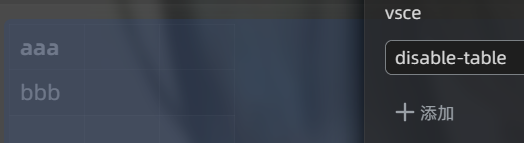
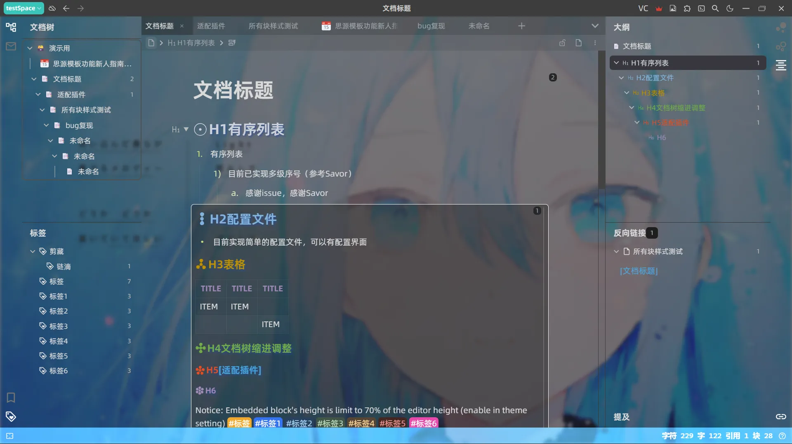

# VSCode Lite Edit

> [!WARNING]
> Theme version 3.0.0 and above is adapted for SiYuan Note 3.7.0. For older SiYuan versions, please download and install the 2.x version of this theme.

A further beautification of the interface from VSCode Lite.

Using dark mode for testing, expected no problems with light mode.

If display errors appear, reload SiYuan please.

Origin author: [TinkMingKing](https://github.com/TinkMingKing)

Instruction for use: [liandi](https://ld246.com/article/1728034766990)
Instruction for config：[GitHub](https://github.com/emptylight370/siyuan-vscodelite-edit/blob/scss/Configure.md)

# Features

- Style various heading levels(futher change)
- Fine-tune layout and color scheme
- Customize change
- Adjust code block
- Table display style
- Fit some plugins
- Limit display height of embedded block(can close)
- Multi-level list serial number style
- Configuration edit page
- doc tree and outline indentation
- Adjust highlight mark style
- Double tab bar, can display pinned tab in single line
- Typewriter mode, center the block where the cursor is located

# Configure

You can currently edit configuration files using the `VC` button on the title bar.

Limited by the configuration loading method, updated configurations for new versions need to be manually enabled in the configuration panel. This way, previous configuration data will not be lost.

# ChangeLog

> Full changelog view [ChangeLog](https://github.com/emptylight370/siyuan-vscodelite-edit/blob/scss/changelog.md)
> Commit history view [whatschange](https://github.com/emptylight370/siyuan-vscodelite-edit/blob/scss/whatschange.md)

- v3.0.9
  - Temporarily disable document tree indent line
- v3.0.8
  - Fix issue that mobile settings sidebar background is not transparent when enabled background plugin adaption
- v3.0.7
  - Refactor save settings reload theme method

# Special fitness

## Custom attributes

### How to use

To enable custom attributes, add the `vsce` attribute in the **Custom Attributes** panel of a block or document, and assign one or more valid attribute values. If mutiple values are used, separate them with spaces.

> [!IMPORTANT]
> Since Siyuan has officially released [Callout block](https://github.com/siyuan-note/siyuan/issues/16051) feature ([Release Note](https://github.com/siyuan-note/siyuan/releases/tag/v3.5.0)), the theme has removed the self-implemented quote block Callout style in previous version. Now, you can perform the migration operation following [this guide](https://github.com/emptylight370/siyuan-vscodelite-edit/issues/32#issuecomment-3642491684).

### Usable attribute values

|      values       | Scope                       | Effect                                                           | Supported Since | Last Updated |
| :---------------: | --------------------------- | ---------------------------------------------------------------- | --------------- | ------------ |
|     `no-tag`      | document or content block   | Disable in-paragraph tag styles in the selected range            | 2.3.0           | 2.3.0        |
|    `mark-hide`    | document or paragraph block | Mark Cloze, hide marked text, display on mouse hover             | 2.3.8           | 2.3.8        |
|    `table-min`    | table block                 | Force the minimum column width without affecting manual settings | 2.3.0           | 2.3.0        |
|    `no-thead`     | table block                 | Disable the color and align of table head(`<thead>`)             | 2.3.0           | 2.3.0        |
|   `hide-thead`    | table block                 | Hide `<thead>` element visually                                  | 2.5.0           | 2.5.0        |
| `av-no-add-entry` | database block              | Hide database add entry button (add function works normally)     | 2.5.2           | 2.6.2        |
| `av-no-add-view`  | database block              | Hide database add view button (add function works normally)      | 2.5.2           | 2.5.2        |
| `av-no-main-key`  | database block              | Hide database primary key                                        | 3.0.0           | 3.0.0        |

## Plugin fitness

It is recommended to disable the plugin compatibility switch when no corresponding plugin is installed to reduce the burden on theme loading.  
Currently adapted plugins are:

- Shortcut key panel(Category title color)
- Custom block Styles(fix display problem in embedded block caused by theme)
- Background Cover(Overrides some plugin settings; it is normal if related settings do not take effect)
- Math Enhancement Plugin(Limit plugin preview width)

In case of you want to know, this is the screenshot about using with Background Cover plugin

## Snippests

- [CodeBlock show action buttons when hover](https://ld246.com/article/1728146248791) by JeffreyChen
- [Show pinned doc name(NO icon version)](https://ld246.com/article/1728392178095) by JeffreyChen
- [Fix the display position of the list sequence shadow](https://ld246.com/article/1749707279347/comment/1749718290195) by queguaiya

# Feedback

Bug report & Known issue: [Issue](https://github.com/emptylight370/siyuan-vscodelite-edit/issues)

Don't use GitHub & Can't visit Github?  
Please [email to me](mailto:1378990254@qq.com)(1378990254@qq.com).  
Or [join QQ channel](https://pd.qq.com/s/7uxvabgbp).  
Or [Liandi Forum](https://ld246.com/article/1728034766990).

Support development: [Link](https://emptylight370.github.io/sponsor)

# LICENSE

Follow origin repository [TinkMingKing/siyuan-themes-vscodelite](https://github.com/TinkMingKing/siyuan-themes-vscodelite) use GPL3.0 LICENSE

# Thanks

|                               Repository                               |                        Author                         |                                         Content                                         | License |
| :--------------------------------------------------------------------: | :---------------------------------------------------: | :-------------------------------------------------------------------------------------: | :-----: |
| [vscodelite](https://github.com/TinkMingKing/siyuan-themes-vscodelite) |    [TinkMingKing](https://github.com/TinkMingKing)    |                                          theme                                          | GPL3.0  |
|       [Savor](https://github.com/royc01/notion-theme/tree/main)        |          [royc01](https://github.com/royc01)          | Connect Siyuan API code (js) Configuration file code(js) list-level effects (css) |  None   |
| [SiYuan api](https://github.com/siyuan-note/siyuan/blob/master/API.md) |                   SiYuan Developers                   |                                      API interface                                      | AGPL3.0 |
|   [doctree modify](https://github.com/zxkmm/siyuan_doctree_compress)   |           [zxkmm](https://github.com/zxkmm)           |                           Document tree beautification ideas                            |   MIT   |
|        [Cliff-Dark](https://github.com/chenshinshi/Cliff-Dark)         | [Chensinshi](https://github.com/chenshinshi)&Crowds21 |                              Transparent background ideas                               |  None   |
