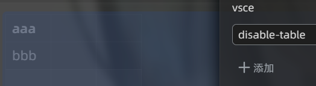

# VSCode Lite Edit

从VSCode Lite脱胎而来，进一步美化界面。

使用暗色模式测试，预计明亮模式没有问题。

如果出现显示错误请重新加载思源。

原作者：[TinkMingKing](https://github.com/TinkMingKing)

使用说明：[链滴](https://ld246.com/article/1728034766990)
配置说明：[GitHub](https://github.com/emptylight370/siyuan-vscodelite-edit/blob/scss/Configure.md)

# 特性

- 各级标题样式（进一步调整）
- 微调布局及配色
- 个性化改动
- 调整代码块
- 表格显示效果
- 适配部分插件
- 限制嵌入块显示高度（可手动关闭）
- 多级列表序号样式
- 配置编辑页面
- 文档树和大纲缩进
- 调整高亮标注样式
- 双标签栏，可将钉住标签页单独一行显示

# 配置

目前可以使用标题栏上的`VC`按钮编辑配置文件。

受配置加载方式限制，新版本更新的配置需要在配置面板手动启用。这样不会丢失之前的配置数据。

# 更新日志

> 完整更新日志查看[changelog](https://github.com/emptylight370/siyuan-vscodelite-edit/blob/scss/changelog.md)

- v2.4.3
  - 优化代码
- v2.4.2
  - 区分静态锚文本和动态锚文本
  - 优化代码
  - 发布模式下不显示主题设置按钮
  - 发布模式下避免出现报错
- v2.4.1
  - 适配API变更(siyuan-note/siyuan#15727)
  - 补充之前一直遗漏的最小思源版本

# 特殊适配

## 自定义属性

### 启用方法

在块或文档的**自定义属性面板**中新增`vsce`属性，在其中填入一个或多个有效的属性值。若使用多个属性值，需以空格分隔。

### 可用属性值

|     可用属性值     | 使用范围     | 使用效果                             | 最低支持 | 最近更新 |
| :----------------: | ------------ | ------------------------------------ | -------- | -------- |
|     `no-thead`     | 表格块       | 禁用表头(`<thead>`)的颜色和居中对齐  | 2.3.0    | 2.3.0    |
|    `table-min`     | 表格块       | 强制使用最小列宽，不影响手动设定     | 2.3.0    | 2.3.0    |
|      `no-tag`      | 文档或内容块 | 禁用所选范围中的段落内标签样式       | 2.3.0    | 2.3.0    |
|  `callout-error`   | 引述块       | callout❌红色                        | 2.3.1    | 2.3.2    |
|   `callout-hint`   | 引述块       | callout💡蓝色                        | 2.3.1    | 2.3.2    |
|   `callout-info`   | 引述块       | calloutℹ️白色                        | 2.3.1    | 2.3.2    |
|   `callout-note`   | 引述块       | callout📝白色                        | 2.3.1    | 2.3.2    |
| `callout-question` | 引述块       | callout❓黄色                        | 2.3.1    | 2.3.2    |
|  `callout-quote`   | 引述块       | callout📣蓝色                        | 2.3.1    | 2.3.2    |
| `callout-success`  | 引述块       | callout✅绿色                        | 2.3.1    | 2.3.2    |
|   `callout-todo`   | 引述块       | callout☑️绿色                        | 2.3.1    | 2.3.2    |
| `callout-warning`  | 引述块       | callout⚠️黄色                        | 2.3.1    | 2.3.2    |
|    `mark-hide`     | 文档或段落块 | 标记挖空，隐藏标记文本，鼠标悬浮显示 | 2.3.8    | 2.3.8    |

## 插件适配

插件适配开关没有安装对应插件时候建议关闭，减轻主题加载负担。  
目前已适配的插件有：

- 快捷键面板（分类标题颜色）
- 自定义块样式（修复由主题造成的嵌入块中自定义块显示问题）
- 替换背景图片（通过让前景透明实现，请将插件设置中的前景透明度调到0关闭，并启用背景虚化(调到大于0)）
- 数学增强插件（限制插件预览宽度）

## 代码片段

- [代码块悬浮显示操作按钮](https://ld246.com/article/1728146248791) by JeffreyChen
- [显示钉住文档名（无图标版本）](https://ld246.com/article/1728392178095) by JeffreyChen
- [修正列表序号阴影显示位置](https://ld246.com/article/1749707279347/comment/1749718290195) by queguaiya

# 反馈

反馈问题和已知问题：[Issue](https://github.com/emptylight370/siyuan-vscodelite-edit/issues)。

不使用GitHub或无法访问？  
[发邮件](mailto:1378990254@qq.com)（1378990254@qq.com）。  
或者[加入QQ频道](https://pd.qq.com/s/7uxvabgbp)。  
或者[链滴社区](https://ld246.com/article/1728034766990)。

# 许可证

跟随上级储存库[TinkMingKing/siyuan-themes-vscodelite](https://github.com/TinkMingKing/siyuan-themes-vscodelite)使用GNU3.0协议

# 感谢

|                                  存储库                                   |                         作者                          |                             内容                             | 许可证  |
| :-----------------------------------------------------------------------: | :---------------------------------------------------: | :----------------------------------------------------------: | :-----: |
|  [vscodelite](https://github.com/TinkMingKing/siyuan-themes-vscodelite)   |    [TinkMingKing](https://github.com/TinkMingKing)    |                            原主题                            | GNU3.0  |
|         [Savor](https://github.com/royc01/notion-theme/tree/main)         |          [royc01](https://github.com/royc01)          | 连接思源API代码(js) 配置文件代码(js) 列表层级效果(css) |   无    |
| [思源api](https://github.com/siyuan-note/siyuan/blob/master/API_zh_CN.md) |                      思源开发者                       |                           API代码                            | AGPL3.0 |
|     [文档树自定义](https://github.com/zxkmm/siyuan_doctree_compress)      |           [zxkmm](https://github.com/zxkmm)           |                        文档树美化思路                        |   MIT   |
|          [Cliff-Dark](https://github.com/chenshinshi/Cliff-Dark)          | [Chensinshi](https://github.com/chenshinshi)&Crowds21 |                         背景透明思路                         |   无    |
